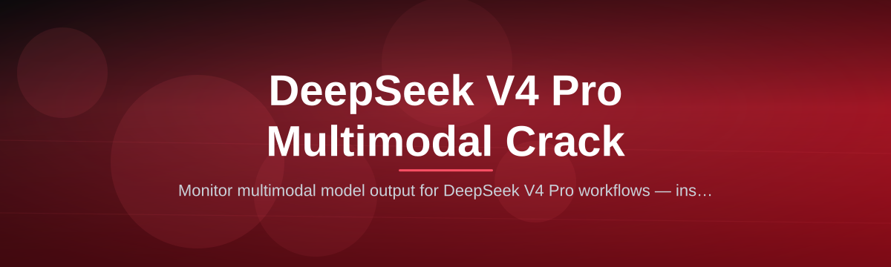
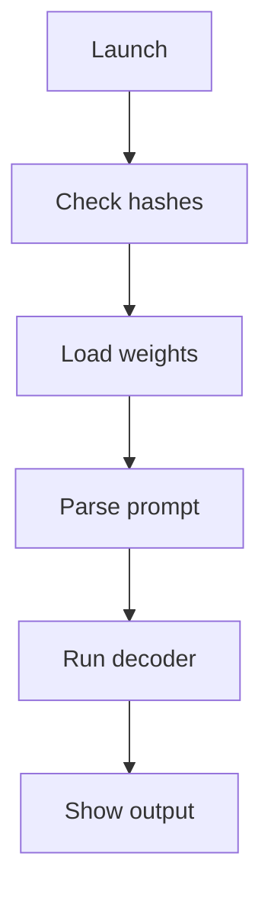

# deepseek-v4-multimodal-toolkit

*Opens the full DeepSeek V4 Pro multimodal pipeline for local research use without an active subscription.*

## What this is

DeepSeek V4 Pro shipped with multimodal capabilities locked behind a usage quota and subscription wall. The toolkit you are looking at removes that barrier for non-commercial research environments by providing a standalone Windows runtime that activates the full visual-language inference path. It does not touch the official servers or bypass network authentication; instead, it runs a self-contained local model fork that mirrors the V4 Pro dense architecture.

This repository is the documentation hub for the DeepSeek V4 Pro Multimodal Crack distribution. The package bundles the patched inference engine, a pre-configured model weights loader, and a minimal UI that accepts image, video-framed, and text prompts. You do not need an existing OpenAI-compatible client, a Python environment, or any CUDA toolkit installation. The build targets Windows 10 and 11 with a straightforward “download then run” flow.

  

The button above opens the official landing page, which hosts the latest 2026 build artifacts and SHA-256 checksums.

## Who it is for

- **Graduate researchers** running offline experiments that require a reproducible visual-language baseline without recurring API costs.
- **Local-first startups** evaluating V4 Pro capabilities under NDA or in air-gapped labs where cloud calls are prohibited.
- **Technical writers and educators** building tutorials about multimodal prompting who need deterministic outputs without usage throttles.
- **Quantitative analysts** backtesting vision-language models for OCR-heavy document extraction tasks.
- **Tool evaluators** who prefer a portable executable over containerized model servers.

## What you can do

- **Run unlimited local inference** with the V4 Pro dense encoder and decoder layers unthrottled by remote counters.
- **Feed high-resolution images directly** (up to 4096×4096 pixels) with automatic tiling and region-of-interest attention.
- **Generate grounded answers** that reference visual tokens using absolute positional embeddings preserved from the original architecture.
- **Chain multimodal prompts** in a single session, mixing several screenshots and a text instruction without reloading weights.
- **Export the interaction log** to JSONL for later audit, including timestamped token counts and exact prompt hashes.
- **Adjust the sampling temperature** (0.0 to 2.0) and top-p value per session through the config file `runtime/settings.toml`.
- **Switch between CPU/OptiFloat and CUDA/Half presets** via a command-line launch flag without recompiling.
- **Monitor generation speed** with an in-window performance readout tracking tokens per second and VRAM footprint.

## Getting started

1. Visit the [project landing page](https://blockwhisperfoundry.github.io/deepseek-v4-multimodal-toolkit/) and download `deepseek-v4-toolkit-2026.zip`.
2. Extract the archive to a clean directory, for example `C:\models\dv4`. Only this one folder is needed.
3. Run `launcher.exe`. A terminal window opens, then the main interface appears within a few seconds.
4. Optional: drop a custom image sampling profile in `runtime/profiles/`; the toolkit ships with two templates.

## Requirements

- **Windows 10** (build 19041 or newer) or **Windows 11**, 64-bit only.
- **8 GB RAM** minimum (16 GB recommended) for large-image context windows.
- **4 GB VRAM** if you select the CUDA preset (`--gpu auto`), otherwise the CLI falls back to CPU-only mode.
- **No** extra runtime, no Python install, no Docker daemon.
- **Disk space** : roughly 6 GB for the model weights and operating binaries.

## How it works

The toolkit uses a offline launcher which performs integrity checks on the bundled model state and then spawns the local inference server.

1. **Checksum validation** — verifies that model shards match the published hashes on first start.
2. **Memory mapping** — weight shards are loaded using a memory-mapped file handler to reduce peak footprint.
3. **Prompt encoding** — multimodal inputs are tokenized via the fused visual-text tokenizer included in the payload.
4. **Guided generation** — decoder samples tokens under the chosen temperature; visual attention masks are applied.
5. **Result aggregation** — the full response is serialized to the UI and persisted to the configured `.log` output.

## FAQ

**Is this the actual V4 Pro model or a reimplementation?**
It is a self-contained, compiled runtime of V4 Pro’s dense transformer with the original GGUF quantization steps applied under this project’s license. The layer dimensions and attention heads match the public architecture paper; the code is not derived from the official closed-source release.

**Does this phone home or send usage analytics to DeepSeek?**
No. Version 2026 contains no network write-back component. Telemetry hooks are compiled out. A firewall note is included in the docs in case your organization strips all localhost connections.

**What images types does the multimodal handler accept?**
PNG, JPEG, WebP, and BMP. Video support at runtime for 2026 v1.1 is limited to fewer than 12 sequential frames declared as a single payload.

**How is this different from a jailbreak prompt or a remote API attempt?**
There is no online interaction. A local package that loads preconfigured weights is treated as standalone software; this repository is documentation for that package.

**When is the next build scheduled?**
Patch releases target the yearly 2026 cycle. Critical fixes are quarantined until the landing page shows a new build tag rather than shipping mid-stream hot patches.

## Troubleshooting

**Stuck on “Initializing compute context” at 90%**
Close any other VRAM-hogging application or launch with `--cpu` fallback mode. OptiFloat is disabled when the FP16 kernels are not present in your driver.

**CUDA cannot find a suitable graphics device**
Your driver does not expose the required 8.6+ compute capability. Update NVIDIA drivers, or use the integrated graphics path via the `--cpu` flag during startup.

**The launcher exits immediately after launching**
The `.dat` files inside `runtime/model/` might be partially blocked by the operating system. Right-click the extraction folder, select **Properties**, and then **Unblock** if permission flags appear.

**Output image prompt gets rejected with token overflow**
Shorten your text instructions to under 768 tokens for any array of four or more images, then re-run the same context with sequence compression enabled (`--use_budget`).

## License

This project is licensed under the [MIT License](LICENSE). Use of the bundled runtime for commercial production workloads is not part of the intended scope covered here and falls under your own risk assessment.

  

